# 전기차 전환 시대, 지역별 전기차 이용 환경 분석 및 정보 제공 시스템

> 전기차 등록 현황, 충전소 인프라, 정책/FAQ 정보를 한곳에서 확인할 수 있는 데이터 기반 정보 제공 시스템  
> 본 문서는 프로젝트 진행 상황에 맞춰 **지속적으로 업데이트**됩니다.

<br>

## 📌 프로젝트 한눈에 보기 

- **프로젝트명**: 전기차 전환 시대, 지역별 전기차 이용 환경 분석 및 정보 제공 시스템
- **진행 기간**: 2026.03.11 ~ 2026.03.18 (8일간)
- **팀명**: 이손신김 코딩전투 (feat. 이순신님)
- **핵심 목표**
  - 지역별 전기차 등록 현황 분석
  - 충전소 위치 및 충전 정보 제공
  - 전기차 보조금 및 정책 FAQ 제공
  - Streamlit 기반 통합 정보 서비스 구현
- [Streamlit Cloud + AWS RDS(MySQL) 웹앱 배포](https://pratique-3team.streamlit.app)

---

## 📎 발표자료

- [발표자료 PDF 보기](./docs/presentation.pdf)

---

## 🎥 시연 영상

- [YouTube에서 시연 영상 보기](https://youtu.be/NCBHpEbNsh4)

---

## 👥 팀 소개

### 1) 팀명
## 이손신김 코딩전투 (feat. 이순신님)

<p align="center">
  
</p>

### 2) 팀원 소개

<p align="center">
  
</p>

| 이름 | 한 줄 소개 | 희망 역할 |
|:---|:---|:---|
| 김지효 장군 | 데이터 속에서 답을 찾는 걸 즐기려고 노력중입니다. | 자료조사 및 크롤링 |
| 손지은 장군 | 데이터에서 답을 SELECT하고, 성장의 기록을 커밋하고자 합니다. | 테이블/모델 설계, MySQL 저장 |
| 신혜지 장군 | 즐겁게 데이터를 누비고 있는 신혜지입니다. | 자료조사 및 크롤링 |
| 이건우 장군 | 데이터를 통해 스포츠를 정교하게 분석하고 싶습니다. | API 및 데이터 처리 |
| 이상현 장군 | 핵심과 원리, 기본기를 중요시합니다. | Streamlit 구현 및 DB 기본 구축 |

---

## 🤝 그라운드 룰

- 모든 팀원은 최소 1개 이상의 의견을 제시한다.
- 모르는 점이나 문제는 바로 공유하고 함께 해결한다.
- 작업 진행 상황과 주요 변경 사항은 디스코드에 간단히 공유한다.
- 작은 아이디어도 자유롭게 제안하고, 비판보다 해결 중심으로 소통한다.
- 마감 전에 최소 1회 이상 진행 상황을 함께 점검한다.

---

## 📖 프로젝트 개요

### 1) 프로젝트 주제
**전기차 전환 시대, 지역별 전기차 이용 환경 분석 및 정보 제공 시스템**

### 2) 프로젝트 배경

최근 탄소중립 정책과 친환경 교통수단 확대에 따라 전기차 보급은 빠르게 증가하고 있습니다.  
하지만 실제 이용자 입장에서는 **지역별 전기차 보급 수준**, **충전소 위치 및 이용 가능 여부**, **충전 요금**, **보조금 정책** 등의 정보가 여러 기관과 플랫폼에 분산되어 있어 필요한 정보를 한 번에 파악하기 어렵습니다.

특히 전기차 구매를 고려하거나 이미 운행 중인 사용자에게는 다음 정보가 중요한 의사결정 요소가 됩니다.

- 지역별 전기차 등록 현황
- 충전소 위치 및 충전 가능 여부
- 충전 요금 정보
- 보조금 및 정책 FAQ

본 프로젝트는 이러한 문제를 해결하기 위해,  
**전기차 등록 현황 데이터 + 충전소 정보 + 정책/FAQ 정보를 통합 제공하는 데이터 기반 정보 시스템**을 구축하는 것을 목표로 합니다.

---

## 🎯 프로젝트 목표

### 주요 목표
1. **지역별 전기차 등록 현황 분석**
   - 지역별 보급 수준과 변화 추이를 시각적으로 제공

2. **지도 기반 충전소 정보 제공**
   - 카카오맵 API를 활용하여 충전소 위치 시각화
   - 가능 시 충전 요금 및 충전 가능 여부 함께 제공

3. **전기차 정책 및 보조금 FAQ 제공**
   - 전기차 구매 및 이용에 필요한 정책 정보를 쉽게 조회 가능하도록 구성

### 확장 목표
- 전기차 vs 비전기차 보급 비율 비교
- 전기차 관련 기사 크롤링 및 키워드 분석

### 학습 목표
- 공공데이터 수집 및 전처리
- MySQL 기반 데이터베이스 설계 및 적재
- Streamlit 기반 데이터 서비스 구현
- 지도 API 연동 및 시각화 경험

---

## 🧩 주요 담당 업무 (R&R)

| 역할 | 담당자 | 담당 업무 | 사용 데이터 | 주요 산출물 |
|:---|:---|:---|:---|:---|
| 데이터 수집, 크롤링 | 신장군 | 지역별 전기차 등록 현황 수집, 정제, 기초 분석 | 전기차 현황 CSV, 자동차 등록현황 XLS/XLSX | 지역별 전기차 현황 테이블, 증감 추이 차트 |
| 소통 채널, 지도 API, 크롤링 | 이장군1 | 노션·디스코드 관리, 카카오맵 및 데이터 API 연동 | 카카오맵 API, 공공 데이터 API | 지도 API 화면, 데이터 테이블 |
| 데이터 수집, 크롤링 | 김장군 | 차종별 FAQ 정리 및 정책/기사 크롤링 | 무공해차 통합 누리집 | FAQ 데이터셋, 기사 크롤링 결과 |
| 크롤링, DB, 백엔드 | 손장군 | MySQL 스키마 설계, 적재, 조회 쿼리 작성, 데이터 연결 | 팀 정제 데이터 전체 | schema.sql, 적재/조회 코드, ERD |
| Streamlit, 통합 | 이장군2 | Streamlit UI 구성, 필터, 화면 통합 | DB 조회 결과 | 메인 대시보드, 검색/필터 UI |

---

## 🗂 프로젝트 구조 

```bash
🚘 TeamProject01_car1/
├─ .env                         # API 키, DB 비밀번호 등 민감한 환경변수
├─ .env.example                 # .env 작성 예시 템플릿
├─ .gitignore                   # Git 추적 제외 파일 목록
├─ README.md                    # 프로젝트 소개 및 실행 가이드
├─ requirements.txt             # 프로젝트 의존성 패키지 목록
│
├─ data/
│  ├─ raw/                      # 원본 데이터 파일
│  │  ├─ charge_fee/            # 충전 요금 원본 엑셀
│  │  │  └─ charge_fee(2026-03-15).xls
│  │  │
│  │  ├─ charger/               # 충전소 원본 CSV
│  │  │  ├─ 한국전력공사_충전소의 위치 및 현황 정보_20250630.csv
│  │  │  └─ 한국환경공단_전기차 충전소 위치 및 운영정보_20221027.csv
│  │  │
│  │  ├─ ev_registration/       # 전기차 등록 원본 파일
│  │  │  ├─ 전기차수(EV_AREA_CAR_STATE)_20190925.csv
│  │  │  ├─ 한국전력공사_지역별 전기차 현황정보.csv
│  │  │  ├─ 한국전력공사_지역별 전기차 현황정보 (1).csv
│  │  │  ├─ 한국전력공사_지역별 전기차 현황정보_201008.csv
│  │  │  ├─ 한국전력공사_지역별 전기차 현황정보_20240731.csv
│  │  │  ├─ 한국전력공사_지역별 전기차 현황정보_20250228.csv
│  │  │  └─ 201001_202603_전기차등록현황.xls
│  │  │
│  │  ├─ faq/                   # FAQ 원본 파일
│  │  │  ├─ seoul_ev_faq.xlsx   # 서울시 FAQ 원본 저장 파일
│  │  │  └─ 전기차 FAQ_제조사별.xlsx
│  │  │
│  │  └─ subsidy/               # 보조금 원본 엑셀
│  │     ├─ national subsidy.xlsx
│  │     └─ 무공해_지자체_보조금.xlsx
│  │
│  ├─ processed/                # 전처리 완료 데이터
│  │  ├─ charger/               # 충전소 가공 데이터
│  │  │  ├─ charger_charger.csv
│  │  │  ├─ charger_merged.csv
│  │  │  └─ charger_station.csv
│  │  │
│  │  └─ ev_registration/       # 전기차 등록 가공 데이터
│  │     ├─ ev_registration_monthly_long.csv
│  │     └─ ev_registration_monthly_wide.csv
│  │
│  └─ webcrawling/              # 크롤링 산출물 및 개인 작업 폴더
│     ├─ 손지은/                # 뉴스/FAQ/워드클라우드 관련 파일
│     │  ├─ ev_seoul_faq_crawler.py
│     │  ├─ naver_news_crawling.py
│     │  ├─ word_cloud.py
│     │  ├─ keyword_frequency.xlsx
│     │  ├─ naver_news_전기차 보조금.xlsx
│     │  ├─ seoul_ev_faq (1).xlsx
│     │  ├─ seoul_ev_faq_categorized.xlsx
│     │  └─ wordcloud.png
│     │
│     ├─ 신혜지/                # 현대 FAQ / 뉴스 수집 관련 파일
│     │  ├─ hyundai_faq.py
│     │  ├─ hyundai_faq_api_data.xlsx
│     │  ├─ naver_news.py
│     │  └─ naver_news_result.csv
│     │
│     ├─ 김지효/                # 국고 보조금 / 지자체 보조금 수집 관련 파일
│     │  ├─ 1_국고보조금.py
│     │  ├─ 2_국고보조금_수소차.py
│     │  ├─ 3_지자체보조금.py
│     │  ├─ 무공해_국고보조금v2.xlsx
│     │  └─ 무공해_지자체_보조금.xlsx
│     │
│     └─ 이건우/                # 전기차 브랜드 별 FAQ 수집 관련 파일
│        ├─ bmw_article_crawler.py
│        ├─ bmw_faq.xlsx
│        ├─ byd_faq.xlsx
│        ├─ kia_faq.xlsx
│        ├─ kia_faq_crawler.py
│        ├─ byd_faq_crawler.py
│        └─ BYD_FAQ_Korean.xlsx
│
├─ sql/
│  ├─ schema.sql                # MySQL 테이블 생성 SQL
│  ├─ view.sql                  # 조회용 View SQL
│  ├─ analysis.sql              # 분석/검증용 SQL
│  └─ create_user.sql           # DB 사용자 생성 SQL
│
├─ docs/
│  ├─ ERD.png                   # ERD 이미지
│  ├─ project_description.md    # 프로젝트 기획 문서
│  ├─ requirements.md           # 요구사항/정리 문서
│  └─ images/                   # 문서용 이미지
│     ├─ 1_team_introduction.png
│     └─ 7_together.png
│
└─ src/
   ├─ __init__.py               # src 패키지 선언
   │
   ├─ app/
   │  ├─ __init__.py
   │  └─ main_app.py            # Streamlit 메인 실행 파일
   │
   ├─ config/
   │  ├─ __init__.py
   │  └─ settings.py            # 환경변수 및 공통 설정
   │
   ├─ data/
   │  ├─ __init__.py
   │  ├─ clean_ev_data.py       # 전기차 데이터 정제
   │  ├─ region_processing.py   # 지역명 표준화 및 지역 컬럼 가공
   │  ├─ region_ev_analysis.py  # 지역별 전기차 분석 로직
   │  ├─ region_ev_section.py   # 지역별 전기차 화면 섹션
   │  ├─ charger_access_analysis.py # 충전소 접근성/요약 분석
   │  ├─ charger_section.py     # 충전소 운영 정보 화면 섹션
   │  ├─ charging_fee_section.py # 충전 요금 화면 섹션
   │  ├─ subsidy_section.py     # 국고 보조금 정책 화면 섹션
   │  ├─ local_subsidy_section.py # 지자체 보조금 정책 화면 섹션
   │  ├─ faq_section.py         # 서울시 FAQ 화면 섹션
   │  ├─ brand_faq_section.py   # 브랜드(제조사)별 FAQ 화면 섹션
   │  └─ news_analysis_section.py # 뉴스 기사 분석 화면 섹션
   │
   ├─ db/
   │  ├─ __init__.py
   │  ├─ insert_data.py         # 전처리 데이터 적재
   │  └─ query_data.py          # Streamlit 조회용 데이터 로드/정리
   │
   ├─ map/
   │  ├─ __init__.py
   │  ├─ kakao_map.py           # 카카오맵 시각화
   │  └─ map_service.py         # 카카오 REST API 검색/좌표 변환
   │
   └─ utils/
      ├─ __init__.py
      └─ helpers.py             # 공통 유틸 함수
```

---

## 🚀 전체 실행 순서 가이드

프로젝트를 로컬 환경에서 실행하려면 아래 순서대로 진행해주세요.

```python
git clone https://github.com/SKNETWORKS-FAMILY-AICAMP/SKN28-1st-3TEAM.git
cd SKN28-1st-3TEAM

# 가상환경 생성 및 활성화
python3 -m venv venv
venv\Scripts\activate  # Windows, Mac: source venv/bin/activate 

# 패키지 설치
pip install -r requirements.txt

# 이후 .env 파일 생성 및 설정
# 이후 MySQL에서 아래 순서대로 실행
# 1) sql/create_user.sql
# 2) USE car1_db;
# 3) sql/schema.sql
# 4) sql/view.sql
# 5) (선택) sql/analysis.sql
# analysis.sql은 분석/확인용 SQL 모음으로, 앱 실행 자체에는 필수는 아닙니다.

# 데이터 적재
python ./src/db/insert_data.py

# Streamlit 실행
streamlit run ./src/app/main_app.py
```

---

## 🛠 기술 스택 및 협업 도구

<p>
  
  
  
  
  <br>
  
  
  
  
</p>

---

## ✅ WBS

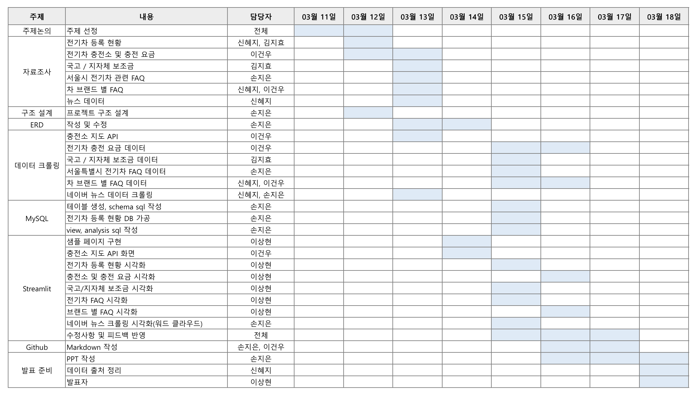

---

## 📂 문서

- [프로젝트 설명 문서](./docs/project_description.md)
- [요구사항 명세서](./docs/requirements.md)

---

## 🏞️ ERD

- 관계있는 모든 엔터티는 1:N 비식별 관계입니다.

---

## 🙌🏻 프로젝트 결과 
- 테스트/ 시연 이미지 삽입

| 지역별 전기차 등록현황 |
|--|
| 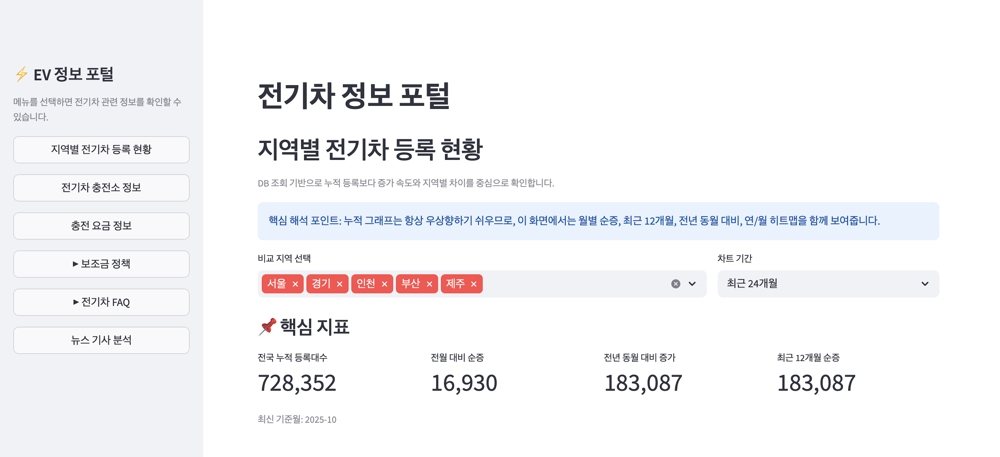 |
| 지역별 전기차 등록 현황을 한눈에 확인할 수 있는 메인 분석 화면입니다. 비교 지역과 차트 기간을 선택해 주요 지표를 빠르게 파악할 수 있습니다. |

| 지역별 전기차 등록현황 - 전국 추세 |
|--|
| 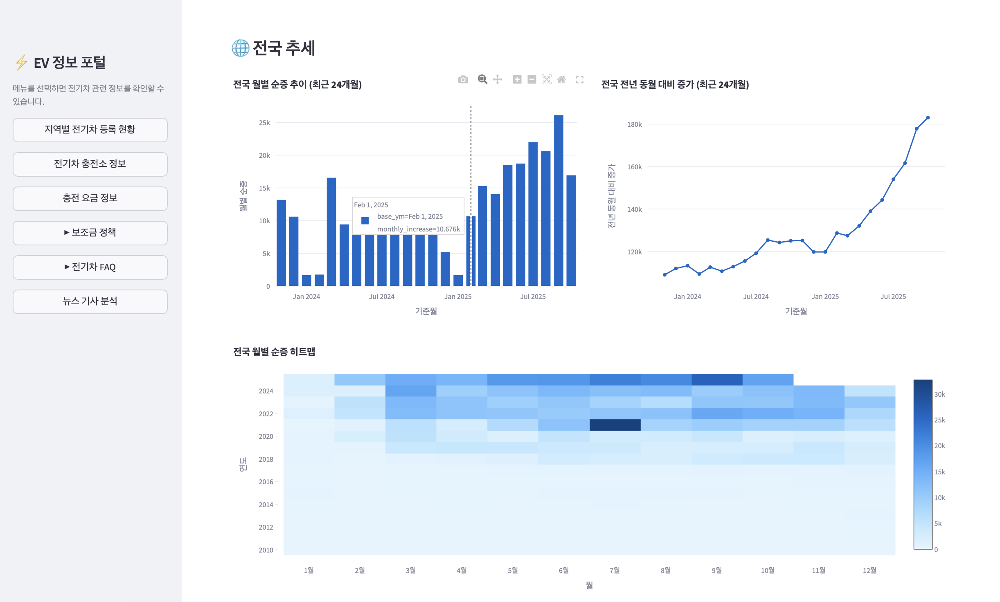 |
| 전국 기준 월별 순증, 전년 동월 대비 증가, 히트맵을 통해 전기차 보급 흐름을 분석하는 화면입니다. 최근 증가 추세와 시기별 변화 패턴을 함께 확인할 수 있습니다. |

| 지역별 전기차 등록현황 - 지역 비교 |
|--|
| 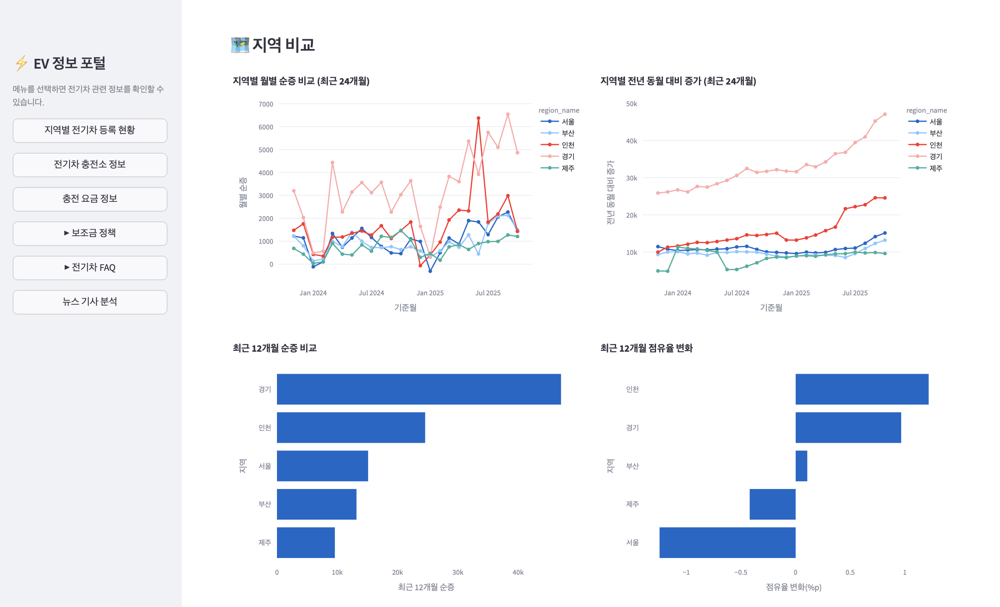 |
| 선택한 지역들의 월별 증가 추이와 점유율 변화를 비교할 수 있는 화면입니다. 어느 지역의 보급 속도가 더 빠른지 직관적으로 확인할 수 있습니다. |


| 지역별 전기차 등록현황 - 연도별 분석 |
|--|
| 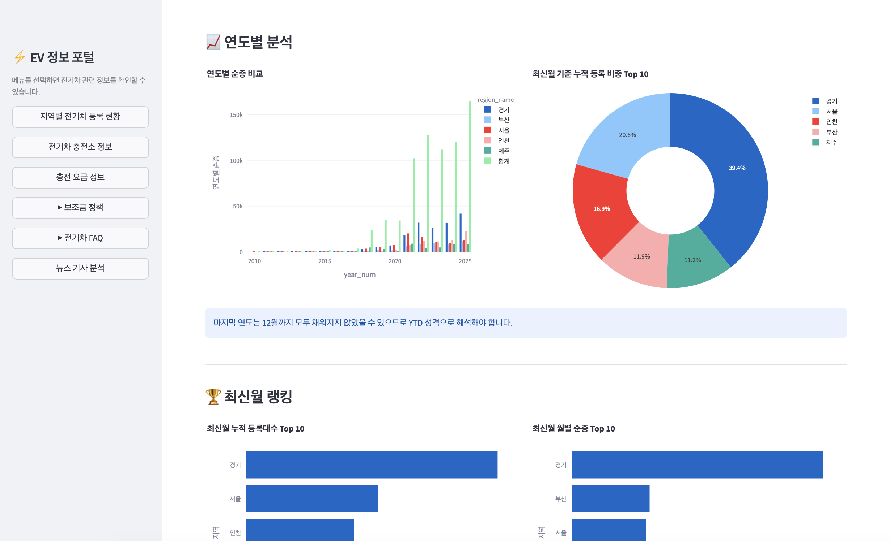 |
| 연도별 순증 비교와 최신월 기준 지역 랭킹을 제공하는 화면입니다. 누적 등록 비중과 최근 증가량을 함께 보며 지역별 특징을 파악할 수 있습니다. |

| 전기차 충전 정보 - 충전소 위치 검색 |
|--|
| 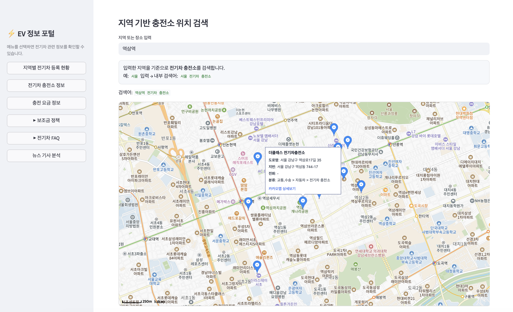 |
| 입력한 지역을 기준으로 주변 전기차 충전소 위치를 지도에서 검색하는 화면입니다. 충전소명, 주소, 좌표 등 위치 정보를 직관적으로 확인할 수 있습니다. |

| 전기차 충전 정보 - 충전 요금 관련 |
|--|
| 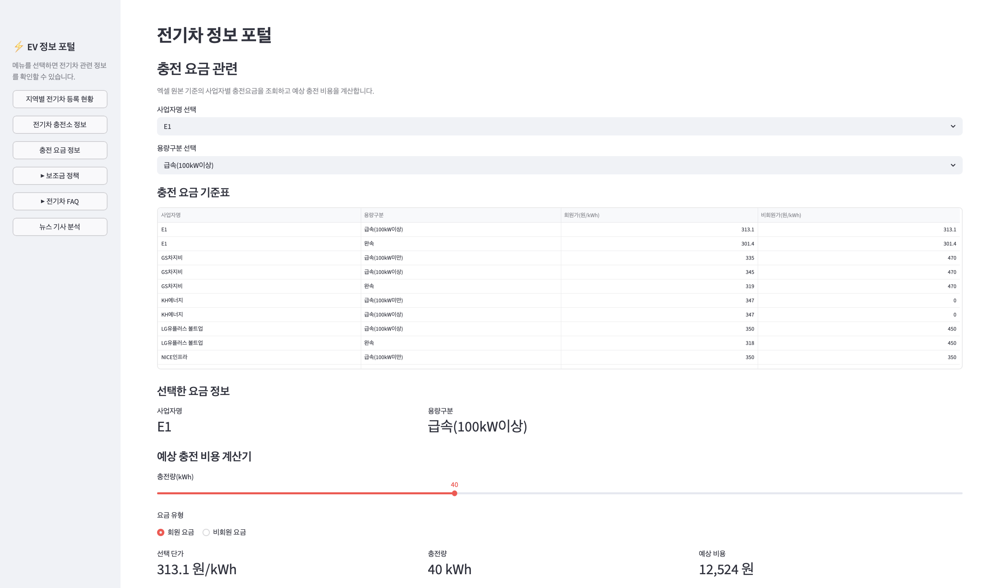 |
| 사업자별 충전 요금을 조회하고 예상 충전 비용을 계산할 수 있는 화면입니다. 회원·비회원 요금과 충전량 기준 예상 비용을 쉽게 비교할 수 있습니다. |

| 보조금 정책 - 국고 보조금 정책 정보  |
|--|
| 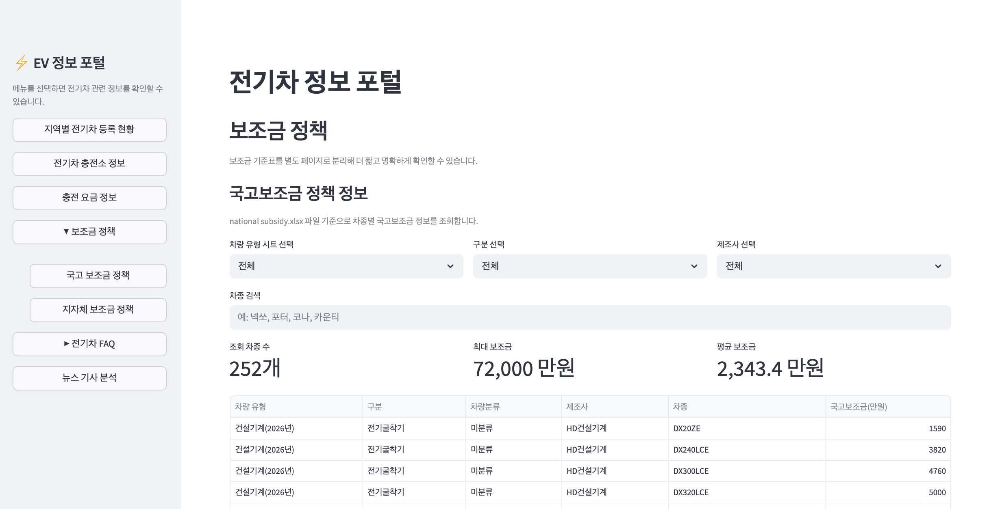 |
| 차종, 제조사, 구분별로 국고 보조금 정보를 조회할 수 있는 정책 화면입니다. 검색 조건에 맞는 차량 보조금 규모를 표 형태로 확인할 수 있습니다. |

| 보조금 정책 - 지자체 보조금 정책 정보  |
|--|
| 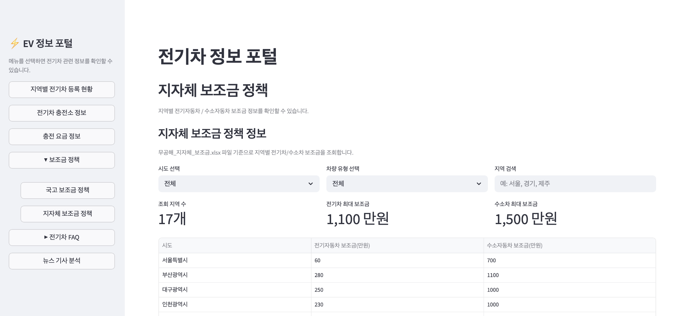 |
| 시도별 전기차·수소차 보조금 정보를 조회할 수 있는 화면입니다. 지역별 추가 지원 규모를 비교하며 실제 구매 혜택을 확인할 수 있습니다. |

| 전기차 FAQ - 브랜드별 전기차 FAQ |
|--|
| 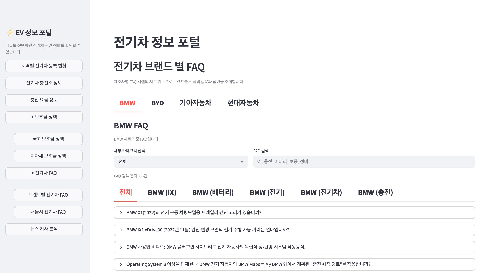 |
| 브랜드별 전기차 관련 자주 묻는 질문을 모아둔 FAQ 화면입니다. 브랜드, 세부 카테고리, 검색어 기준으로 원하는 정보를 빠르게 찾을 수 있습니다. |

| 전기차 FAQ - 서울시 전기차 FAQ |
|--|
| 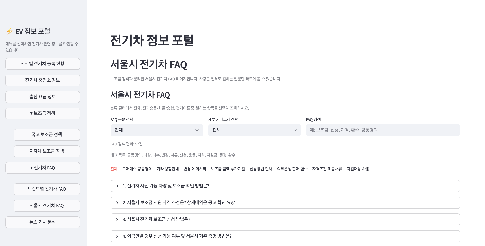 |
| 서울시 전기차 보조금과 행정 안내를 중심으로 정리한 FAQ 화면입니다. 구분, 세부 카테고리, 검색 기능을 통해 필요한 질문을 쉽게 탐색할 수 있습니다. |

| 뉴스 기사 분석 - '전기차 보조금' 키워드 분석 |
|--|
| 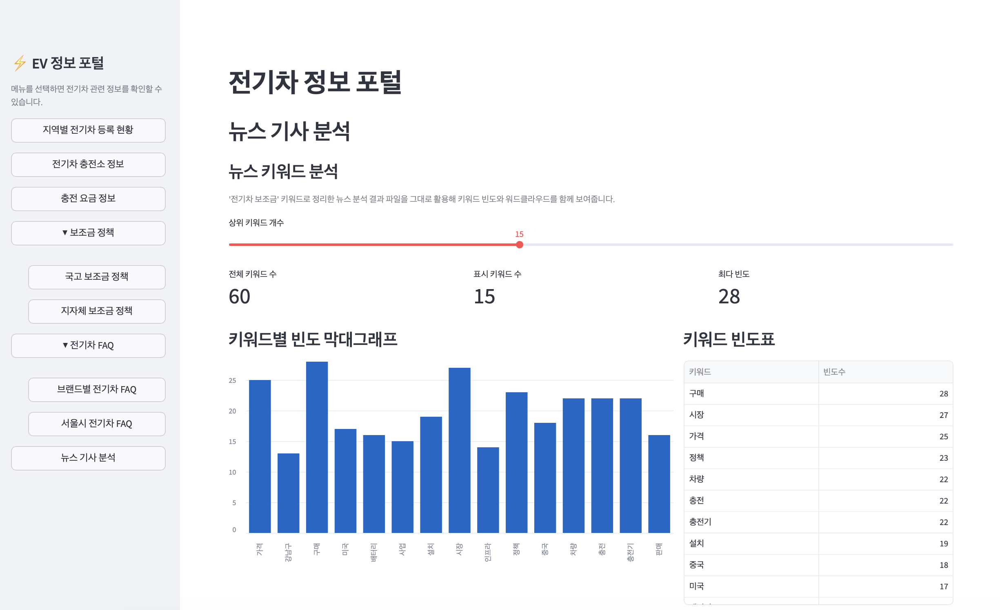 |
| 전기차 관련 뉴스에서 자주 등장한 키워드를 막대그래프와 표로 보여주는 분석 화면입니다. 최근 어떤 이슈와 주제가 많이 다뤄졌는지 빠르게 파악할 수 있습니다. |

| 뉴스 기사 분석 - 워드 클라우드 생성 |
|--|
| 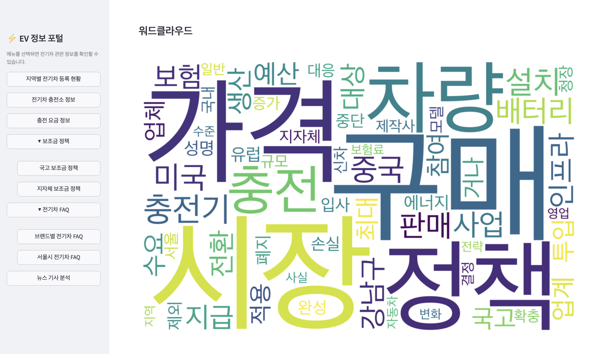 |
| 뉴스 데이터 기반 핵심 키워드를 워드클라우드로 시각화한 화면입니다. 주요 이슈를 직관적으로 확인하고 전체 뉴스 흐름을 한눈에 이해할 수 있습니다. |

---

## ✨ 한 줄 정리

**전기차 이용자가 지역별 전기차 등록 현황, 충전소 정보, 정책 FAQ를 한 번에 확인할 수 있도록 돕는 통합 정보 제공 시스템입니다.**

---

## 👏 첫 번째 프로젝트 소감

### 🐱 **김지효 장군**
어려운 과제였지만 끝까지 완수하며 스스로 한계를 넘어서는 성취감을 느낄 수 있었습니다. 짧은 시간이었지만 팀원분들과 소통하며 성장할 수 있었고 부족한 부분들도 함께 채워나갈 수 있어서 새로웠습니다.

### 😊 **손지은 장군**
첫 번째 프로젝트를 진행하면서 수업시간에 배운 Python, MySQL, 웹 크롤링, Streamlit 내용을 하나의 주제 안에서 직접 적용해볼 수 있어 정말 의미 있는 시간이었습니다. 단순히 개념을 배우는 데서 끝나는 것이 아니라, 실제 데이터 수집부터 정리, 분석, 구현까지 연결해보며 더 깊게 이해할 수 있었습니다. 특히 팀워크 부분에서 보완해야할 부분이 무엇인지 느낄 수 있었고 채우기 위해 노력했습니다. 앞으로의 교육 과정도 기대할 수 있는 시간이었습니다.

### 👾 **신혜지 장군**
처음 만나는 팀원들과 같이 협업하며 지난 2주동안 배웠던 것들을 골고루 (Python, SQL 그리고 깃헙 활용까지) 사용해보고 적용시켜 나가는 과정에서 많이 배울 수 있었습니다. 프로젝트를 진행할 때 어떠한 것들을 중요시 여겨야 하는지도 협업하며 느낄 수 있었고, 동시에 아직 배우고 익혀야 할 것이 많다는 것을 스스로 깨달으며 동기 부여가 되는 시간이었습니다.

### 👍🏻 **이건우 장군**
공공데이터 API와 Selenium 크롤링으로 확보한 정밀한 데이터를 카카오맵 API와 연동하며, 파편화된 정보가 사용자 중심 서비스로 변모하는 과정을 경험했습니다. 기술 스택 간 유기적 연결을 통해 추상적 데이터를 실효성 있는 서비스로 구현하는 메커니즘을 체득할 수 있는 시간이었습니다

### 😇 **이상현 장군**
오래간만에 여러 군데 찾아보며 앱 작성을 진행했는데, 실제로 csv, excel, db를 연동하여 시각화하는 앱을 만들어보니 좀 더 실무에 숙달이 된 느낌이 듭니다. 그리고 진행 중 많이 막히는 부분이 많았는데 이런 부분이 저를 좀 더 성장시켜준 것 같습니다. 한 번에 해결되는 솔루션보다는 시행착오를 통해 진행하는 솔루션이 중요하다는 사실을 다시 한 번 깨닫게 해줬습니다. 그리고 팀원들이 작성한 자료와 페이지를 연동하며 다른 사람들은 어떻게 작업하는지에 대한 좋은 공부가 되었습니다.
